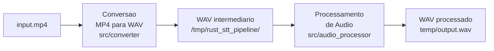
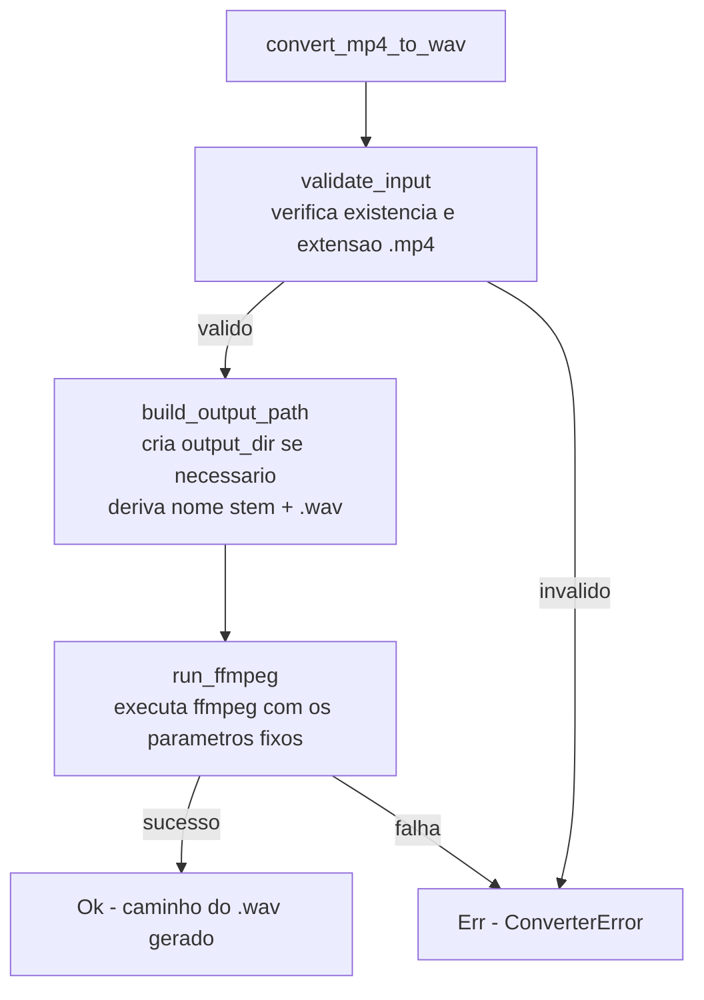
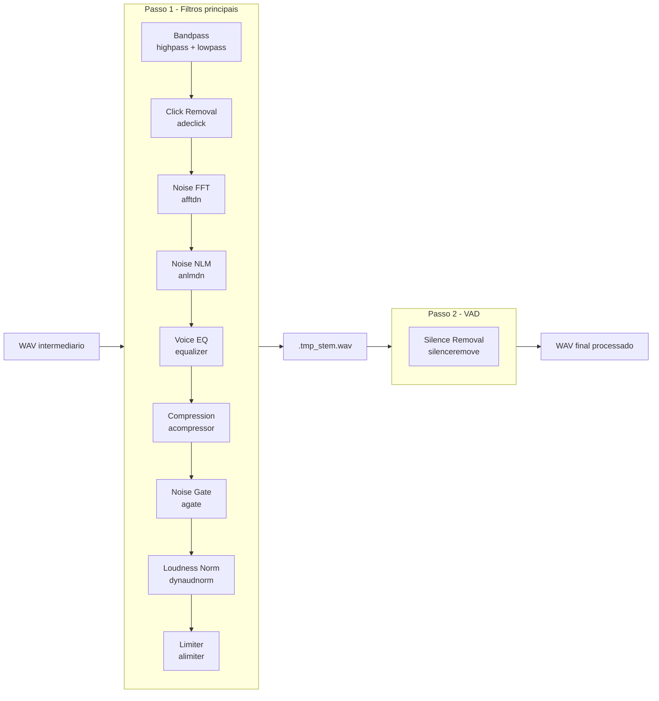

# Pipeline de Conversão e Processamento de Áudio

> **Objetivo:** preparar áudio de vídeos MP4 para pipelines de
> Speech-to-Text (STT) — máxima inteligibilidade da fala, mínimo ruído,
> formato padronizado.

---

## Visão Geral

O pipeline transforma um arquivo `.mp4` em um `.wav` limpo em dois grandes
estágios executados por processos `ffmpeg` independentes:



O WAV intermediário é criado em `std::env::temp_dir()` e **removido automaticamente**
ao final, independente de sucesso ou falha.

---

## Estágio 1 — Conversão (`src/converter/mod.rs`)

### O que faz

Extrai a trilha de áudio do MP4, descarta o vídeo e grava um WAV com
parâmetros fixos otimizados para STT:

| Parâmetro | Valor | Motivo |
|---|---|---|
| **Codec** | `pcm_s16le` — PCM signed 16-bit little-endian | Sem compressão, sem perdas; formato universal para STT |
| **Canais** | `1` (mono) | Modelos de STT esperam mono; stereo dobra o tamanho sem ganho |
| **Taxa de amostragem** | `16 000 Hz` | Padrão da maioria dos modelos (Whisper, Wav2Vec2, etc.); captura toda a faixa da fala (300 Hz–8 kHz) |

### Comando ffmpeg gerado

```
ffmpeg -y -i input.mp4 -vn -acodec pcm_s16le -ac 1 -ar 16000 output.wav
```

### Fluxo interno



---

## Estágio 2 — Processamento (`src/audio_processor/`)

O processamento é dividido em **dois passes ffmpeg** para contornar uma
incompatibilidade do ffmpeg 7.x em que `dynaudnorm` e `silenceremove` não
funcionam corretamente na mesma chain `-af`.



---

## Etapas de Processamento — Detalhamento

### Etapa 1 — Bandpass (HPF + LPF)

**Filtro:** `highpass=f=100,lowpass=f=16000`

**O que é:**
Filtro de banda que deixa passar apenas as frequências entre 100 Hz e 16 000 Hz,
bloqueando tudo fora dessa faixa.

**Por que:**
- **HPF (100 Hz):** elimina ruídos de baixíssima frequência — vibração de mesa,
  ar-condicionado, tráfego — que não fazem parte da fala mas ocupam energia
  desnecessária no sinal.
- **LPF (16 000 Hz):** remove chiados e ruídos de alta frequência acima da faixa
  vocal útil. A fala humana vai até ~8 kHz; 16 kHz é o limite da taxa de
  amostragem do WAV de saída.
- Reduz o volume de dados que os filtros posteriores precisam processar.

**Posição na chain:** primeiro, para que todos os filtros seguintes operem
sobre um sinal já limpo nas extremidades.

| Parâmetro | Padrão | Descrição |
|---|---|---|
| `hpf_hz` | `100` | Frequência de corte do passa-altas |
| `lpf_hz` | `16000` | Frequência de corte do passa-baixas |

---

### Etapa 2a — Remoção de Cliques (`adeclick`)

**Filtro:** `adeclick=w=55:o=75`

**O que é:**
Detector de descontinuidades abruptas no sinal. Quando encontra uma amostra
que "salta" de forma anormal em relação às vizinhas, substitui por interpolação
das amostras ao redor.

**Por que:**
- Cliques, estouros de microfone, interferências elétricas e cortes abruptos
  de edição geram transientes de altíssima energia que contaminam a análise FFT
  das etapas seguintes.
- Vem **antes** de qualquer filtro espectral justamente por isso: um clique
  "polui" toda a janela de FFT ao redor dele.

| Parâmetro | Padrão | Descrição |
|---|---|---|
| `click_window_ms` | `55.0` | Tamanho da janela de análise em ms |
| `click_overlap_pct` | `75` | Sobreposição entre janelas em % (range: 50–95) |

---

### Etapa 2b — Redução de Ruído FFT (`afftdn`)

**Filtro:** `afftdn=nf=-25`

**O que é:**
Analisa o espectro de frequência do áudio por janelas FFT e atenua
componentes espectrais cujo nível está abaixo do piso de ruído estimado.

**Por que:**
Ruídos estacionários (chiado de gravação, hum elétrico, ventilador de
computador) aparecem como componentes espectrais constantes ao longo do
tempo. O `afftdn` identifica esses "andares baixos" do espectro e os
remove sem tocar na fala, que é dinâmica.

**Complementa** o `anlmdn` da etapa seguinte: o FFT é eficiente em ruído
estacionário, o NLM é eficiente em ruído variável.

| Parâmetro | Padrão | Descrição |
|---|---|---|
| `noise_floor_db` | `-25` | Piso de ruído estimado em dBFS — menor = menos agressivo |

---

### Etapa 2c — Redução de Ruído NLM (`anlmdn`)

**Filtro:** `anlmdn=s=7:p=0.002:r=0.002:m=15`

**O que é:**
Non-Local Means Denoiser — algoritmo estatístico que procura padrões similares
ao longo do sinal e usa essa similaridade para distinguir sinal verdadeiro
(fala, que tem estrutura repetitiva) de ruído (que é aleatório).

**Por que:**
- Vozes de fundo, murmúrio de pessoas ao redor e ruídos não-estacionários
  **não são removidos pelo FFT** porque mudam ao longo do tempo. O NLM lida
  com isso por ser baseado em similaridade de conteúdo, não em limiar espectral.
- Opera em domínio do tempo, complementando o `afftdn` que opera em frequência.
- **Opcional:** pode ser desabilitado com `enable_nlmeans: false` para arquivos
  com pouco ruído de fundo (ganho em velocidade de processamento).

| Parâmetro | Padrão | Descrição |
|---|---|---|
| `enable_nlmeans` | `true` | Liga/desliga esta etapa |
| `nlmeans_strength` | `7.0` | Força da denoising (1–100) |
| `nlmeans_patch_radius_s` | `0.002` | Raio do patch de comparação em segundos |
| `nlmeans_research_radius_s` | `0.002` | Raio de busca de patches similares em segundos |
| `nlmeans_max_gain` | `15.0` | Ganho máximo de correção aplicado |

---

### Etapa 3 — Equalização de Voz (`equalizer`)

**Filtro:** `equalizer=f=3000:t=h:width=2000:g=3`

**O que é:**
Filtro paramétrico de dois polos (peaking EQ) que aplica um ganho
positivo centrado em 3 000 Hz, cobrindo a faixa de 2 000 a 4 000 Hz.

**Por que:**
A região de 2–4 kHz é onde se concentram os **formantes** de consoantes e
as pistas de inteligibilidade da fala humana. Realçar esta faixa:
- Aumenta a clareza de consoantes fricativas (`s`, `f`, `ch`) e plosivas (`p`, `t`)
- Melhora a diferenciação entre fonemas similares
- Compensa a perda de brilho típica de microfones baratos e gravações em ambientes
  com absorção acústica

> **Nota técnica:** o parâmetro `t=h` (bandwidth em Hz) é obrigatório.
> `t=o` interpretaria `width` como oitavas — um valor de 2000 octaves
> cria um filtro matematicamente inválido que zera todo o sinal.

| Parâmetro | Padrão | Descrição |
|---|---|---|
| `voice_eq_freq_hz` | `3000` | Frequência central do realce |
| `voice_eq_gain_db` | `3.0` | Ganho aplicado em dB |
| `voice_eq_bandwidth_hz` | `2000` | Largura da banda realçada em Hz (`t=h`) |

---

### Etapa 4a — Compressão Dinâmica (`acompressor`)

**Filtro:** `acompressor=threshold=-18dB:ratio=3:attack=5:release=50:makeup=2dB`

**O que é:**
Compressor de dinâmica que reduz a diferença entre os trechos mais altos e
mais baixos do áudio. Quando o sinal ultrapassa `-18 dBFS`, a taxa de
compressão 3:1 reduz o ganho acima do limiar.

**Por que:**
- A fala natural tem dinâmica ampla: sílabas tônicas podem ser 20 dB mais
  altas que sílabas átonas, e pausas entre palavras são quase silenciosas.
- Modelos de STT funcionam melhor com volume consistente: trechos muito
  baixos podem ser tratados como silêncio, e trechos muito altos podem
  saturar o modelo.
- `makeup=2dB` compensa o ganho médio reduzido pela compressão, mantendo
  o nível geral próximo ao original.
- `attack=5ms` e `release=50ms`: rápido o suficiente para reagir a picos,
  mas lento o suficiente para não distorcer consoantes plosivas.

| Parâmetro | Padrão | Descrição |
|---|---|---|
| `compress_threshold_db` | `-18` | Limiar de início da compressão em dBFS |
| `compress_ratio` | `3.0` | Taxa de compressão (3:1 = cada 3 dB acima vira 1 dB) |
| `compress_makeup_db` | `2.0` | Ganho de compensação pós-compressão |

---

### Etapa 4b — Noise Gate (`agate`)

**Filtro:** `agate=threshold=0.01:attack=5:release=100:ratio=10:knee=2.828`

**O que é:**
Um noise gate abre a passagem de áudio apenas quando o sinal ultrapassa um
limiar de amplitude. Abaixo do limiar, o sinal é atenuado pela razão
configurada.

**Por que:**
- Vozes de fundo fracas, respiração e ruído ambiente aparecem com mais
  evidência nos **silêncios entre palavras**, após a compressão elevar o
  nível geral.
- O gate fecha nesses momentos, silenciando o fundo sem afetar a fala
  (que está bem acima do limiar de `0.01` ≈ `-40 dBFS`).
- `knee=2.828` cria uma transição suave (não um corte abrupto), evitando
  que o gate "morda" o início de palavras que começam com sons fracos.
- **Opcional:** desabilitar com `enable_noise_gate: false` em gravações
  limpas evita risco de corte em falas muito pausadas.

| Parâmetro | Padrão | Descrição |
|---|---|---|
| `enable_noise_gate` | `true` | Liga/desliga esta etapa |
| `gate_threshold` | `0.01` | Limiar em amplitude linear (≈ -40 dBFS) |
| `gate_ratio` | `10.0` | Atenuação abaixo do limiar |
| `gate_knee` | `2.828` | Suavidade da curva de transição em dB |

---

### Etapa 5a — Normalização de Loudness (`dynaudnorm`)

**Filtro:** `dynaudnorm=p=0.9:m=100:r=0.9:maxgain=15`

**O que é:**
Dynamic Audio Normalizer — aplica um ganho variável ao longo do tempo para
manter o volume subjetivo consistente, sem comprimir a dinâmica de forma
perceptível.

**Por que:**
- Gravações de reuniões e entrevistas têm variações grandes de volume entre
  falantes, microfones diferentes e mudanças de distância.
- A normalização garante que STT receba áudio em uma faixa de amplitude
  consistente, independente da gravação original.
- Usa `maxgain=15` para limitar ganhos excessivos em trechos muito baixos
  (o que amplificaria o ruído residual junto com a fala).
- **Por que não `loudnorm`?** O filtro EBU R128 (`loudnorm`) requer dois
  passes completos pelo arquivo — o segundo passe usa estatísticas do primeiro
  para ajustar o ganho. Em arquivos longos (> 10 min) isso causa travamento
  no ffmpeg 7.x. O `dynaudnorm` opera em single-pass com uma janela deslizante.

| Parâmetro | Padrão | Descrição |
|---|---|---|
| `loudnorm_peak` | `0.9` | Nível de pico alvo (0.0–1.0 ≈ -0.9 dBFS) |
| `loudnorm_max_gain` | `15.0` | Ganho máximo aplicável em dB |

---

### Etapa 5b — Limiter (`alimiter`)

**Filtro:** `alimiter=limit=0.9:attack=5:release=50:level=disabled`

**O que é:**
Limitador lookahead que impede que qualquer amostra ultrapasse o nível
configurado, usando uma janela de antecipação de 5ms para reagir antes
de picos acontecerem.

**Por que:**
- A normalização pode gerar picos residuais acima de `0 dBFS` em sinais
  com transientes irregulares.
- Picos acima de `0 dBFS` causam clipping digital no arquivo WAV de 16-bit,
  introduzindo distorção irreversível.
- O limiter é a **proteção final** da cadeia: garante que o arquivo entregue
  ao STT nunca sature, sem distorcer a fala (5ms de lookahead é invisível
  perceptualmente).
- `level=disabled` evita que o alimiter reprocesse o ganho de saída,
  mantendo o nível definido pelo `dynaudnorm`.
- **Opcional:** desabilitar com `enable_limiter: false` em sinais já
  bem controlados pela compressão.

| Parâmetro | Padrão | Descrição |
|---|---|---|
| `enable_limiter` | `true` | Liga/desliga esta etapa |
| `limiter_limit` | `0.9` | Pico máximo permitido (≈ -0.9 dBFS) |
| `limiter_attack_ms` | `5.0` | Tempo de antecipação em ms |
| `limiter_release_ms` | `50.0` | Tempo de recuperação em ms |

---

### Etapa 6 — Remoção de Silêncios / VAD (`silenceremove`)

**Filtro:** `silenceremove=stop_periods=-1:stop_silence=0.3:stop_threshold=-50dB`

**O que é:**
Voice Activity Detection (VAD) — detecta trechos de silêncio prolongados
e os remove do arquivo final.

**Por que:**
- Vídeos de reunião, aulas e entrevistas têm longas pausas entre falas
  que aumentam o tamanho do arquivo e o tempo de inferência do STT sem
  acrescentar informação.
- Remover silêncios de mais de 0.3s reduz o arquivo (neste projeto, de
  ~71 MB para ~67 MB em um vídeo de 38 minutos) e acelera o STT.

**Limitação do ffmpeg 7.x:**

O parâmetro `start_periods=1` (que removeria silêncio inicial) não funciona
quando o áudio começa diretamente com fala — o filtro interpreta que deve
aguardar um silêncio antes de iniciar o output e nunca produz saída. Por
isso, usa-se apenas `stop_periods=-1`, que remove silêncios ao longo de
todo o áudio sem depender do estado inicial.

**Passe separado:**

Este filtro roda em um segundo processo `ffmpeg` independente pois
`dynaudnorm` + `silenceremove` na mesma chain `-af` produzem áudio
silencioso no ffmpeg 7.x (comportamento confirmado em testes).

| Parâmetro | Padrão | Descrição |
|---|---|---|
| `silence_threshold_db` | `-50` | Limiar de silêncio em dBFS |
| `silence_min_duration_s` | `0.3` | Duração mínima para remoção em segundos |

---

## Configuração Completa (`AudioProcessingConfig`)

Todas as etapas são configuráveis via `AudioProcessingConfig`. Etapas
opcionais podem ser desabilitadas sem afetar as demais.

```rust
// Configuração padrão (recomendada para STT)
let config = AudioProcessingConfig::default();

// Configuração mínima — apenas filtros obrigatórios
let config = AudioProcessingConfig {
    enable_click_removal: false,
    enable_nlmeans:        false,
    enable_noise_gate:     false,
    enable_limiter:        false,
    ..AudioProcessingConfig::default()
};

// Configuração agressiva — gravações muito ruidosas
let config = AudioProcessingConfig {
    noise_floor_db:     -15,   // afftdn mais agressivo
    nlmeans_strength:   20.0,  // anlmdn mais forte
    gate_threshold:     0.02,  // gate fecha mais cedo
    ..AudioProcessingConfig::default()
};
```

### Tabela de todos os parâmetros

| Campo | Padrão | Etapa | Descrição |
|---|---|---|---|
| `hpf_hz` | `100` | Bandpass | Frequência de corte HPF em Hz |
| `lpf_hz` | `16000` | Bandpass | Frequência de corte LPF em Hz |
| `enable_click_removal` | `true` | Click Removal | Liga/desliga `adeclick` |
| `click_window_ms` | `55.0` | Click Removal | Janela de análise em ms |
| `click_overlap_pct` | `75` | Click Removal | Sobreposição em % (50–95) |
| `noise_floor_db` | `-25` | Noise FFT | Piso de ruído para `afftdn` |
| `enable_nlmeans` | `true` | Noise NLM | Liga/desliga `anlmdn` |
| `nlmeans_strength` | `7.0` | Noise NLM | Força de denoising (1–100) |
| `nlmeans_patch_radius_s` | `0.002` | Noise NLM | Raio do patch em segundos |
| `nlmeans_research_radius_s` | `0.002` | Noise NLM | Raio de busca em segundos |
| `nlmeans_max_gain` | `15.0` | Noise NLM | Ganho máximo de correção |
| `voice_eq_freq_hz` | `3000` | Voice EQ | Frequência central do realce |
| `voice_eq_gain_db` | `3.0` | Voice EQ | Ganho do realce em dB |
| `voice_eq_bandwidth_hz` | `2000` | Voice EQ | Largura de banda em Hz |
| `compress_threshold_db` | `-18` | Compression | Limiar de compressão em dBFS |
| `compress_ratio` | `3.0` | Compression | Taxa de compressão |
| `compress_makeup_db` | `2.0` | Compression | Ganho de makeup em dB |
| `enable_noise_gate` | `true` | Noise Gate | Liga/desliga `agate` |
| `gate_threshold` | `0.01` | Noise Gate | Limiar de abertura (linear) |
| `gate_ratio` | `10.0` | Noise Gate | Taxa de atenuação abaixo do limiar |
| `gate_knee` | `2.828` | Noise Gate | Suavidade da transição em dB |
| `loudnorm_peak` | `0.9` | Loudness | Pico alvo do `dynaudnorm` |
| `loudnorm_max_gain` | `15.0` | Loudness | Ganho máximo em dB |
| `enable_limiter` | `true` | Limiter | Liga/desliga `alimiter` |
| `limiter_limit` | `0.9` | Limiter | Pico máximo permitido |
| `limiter_attack_ms` | `5.0` | Limiter | Lookahead em ms |
| `limiter_release_ms` | `50.0` | Limiter | Recuperação em ms |
| `silence_threshold_db` | `-50` | VAD | Limiar de silêncio em dBFS |
| `silence_min_duration_s` | `0.3` | VAD | Duração mínima de silêncio a remover |

---

## Estrutura de Arquivos

```
src/
├── main.rs                        ← pipeline CLI
├── converter/
│   └── mod.rs                     ← convert_mp4_to_wav()
└── audio_processor/
    ├── mod.rs                     ← process_audio(), AudioProcessingConfig
    └── filters.rs                 ← uma função por etapa de filtragem
```

---

## Formato de Saída

Todo arquivo processado é entregue com estes parâmetros fixos,
independente do áudio original:

| Propriedade | Valor |
|---|---|
| **Formato** | WAV (RIFF) |
| **Codec** | PCM signed 16-bit little-endian (`pcm_s16le`) |
| **Canais** | 1 (mono) |
| **Taxa de amostragem** | 16 000 Hz |
| **Bit depth** | 16 bits |
| **Loudness alvo** | ≈ -17 LUFS |
| **Pico máximo** | ≈ 0.4 dBFS |

Esses valores são compatíveis com os requisitos de entrada dos principais
modelos de STT (Whisper, Wav2Vec 2.0, DeepSpeech, Vosk).
