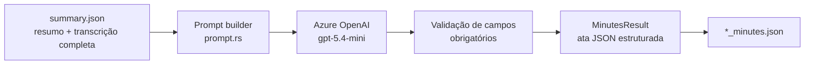

# Gerador de Ata — Minutes (formato FLOW)

> **Objetivo:** transformar o `summary.json` gerado pelo `summarize` em uma
> ata estruturada completa seguindo o template FLOW — Registro de Reunião de
> Alinhamento do Distrito Tecnológico SENAI SP.

---

## Visão Geral

O módulo `minutes` recebe o summary de uma reunião e usa o Azure OpenAI para
preencher as 8 seções do template FLOW, produzindo um JSON rastreável e
auditável.



**Por que a transcrição completa é enviada ao LLM?**

O `summary.json` contém toda a `transcript` (todos os segmentos com falante,
tempo e texto). Ao enviar o JSON completo, o LLM tem acesso a falas exatas
para preencher citações-chave, identificar todos os tópicos discutidos em
ordem cronológica e analisar o clima da reunião com mais precisão.

Se o JSON ultrapassar ~120 KB, os segmentos intermediários da `transcript`
são truncados automaticamente (preservando início e fim), com aviso em
`stderr`.

---

## Como Usar

### Pré-requisito

O arquivo `summary.json` deve ter sido gerado pelo `summarize`:

```sh
cargo run --bin summarize -- temp/audio_transcript.json reuniao.vtt
# gera: temp/audio_summary.json
```

### Comando

```sh
cargo run --bin minutes -- <summary.json>
```

### Exemplo

```sh
cargo run --bin minutes -- temp/reuniao_summary.json
# gera: temp/reuniao_minutes.json
```

### Saída no terminal

```
Minutes — FLOW Registro de Reunião de Alinhamento
  Summary    : temp/reuniao_summary.json
  Deployment : gpt-5.4-mini
  API version: 2025-01-01-preview

Gerando ata via gpt-5.4-mini...
────────────────────────────────────────────────────────────
ATA GERADA (tempo: 24.3s)
────────────────────────────────────────────────────────────
Título : Reunião de Alinhamento — Refinamento de Requisitos
Data   : 16/04/2026

Participantes (4):
  • Mariana Cardoso Fabre Albino (Facilitadora)
  • Joana Lopes (Participante)
  • Lucas Dittrich (Participante)
  • Graziela Poli Covilo (Participante)

Tópicos discutidos: 3
  • Escopo por ano/série e escalabilidade da plataforma
  • Relatórios PDF/Excel — finalidade e estrutura
  • Personas: gestor e professor

Decisões tomadas: 4
  [D1] A plataforma será desenhada de forma escalável
  [D2] Relatórios PDF/Excel com foco em auditoria e legislação
  [D3] O questionário será usado como triagem para entrevistas
  [D4] Integração entre sistema e planejamento anual do professor

Action items: 4
  • [Lucas Dittrich / hoje] Finalizar e enviar questionário para validação
  • [Joana Lopes / após receber] Revisar e aprovar o questionário
────────────────────────────────────────────────────────────
USO DE TOKENS (Azure OpenAI)
────────────────────────────────────────────────────────────
  Entrada  :    18920 tokens   ($0.014190)
  Saída    :     3200 tokens   ($0.014400)
  Total    :    22120 tokens   ($0.028590)
  (preços: $0.750/1M entrada · $4.500/1M saída — gpt-5.4-mini)

✓ Ata salva em: temp/reuniao_minutes.json
```

---

## Configuração (`.env`)

Usa as mesmas variáveis do `summarize`:

| Variável | Obrigatória | Descrição |
|---|---|---|
| `AZURE_OPENAI_API_KEY` | sim | Chave do recurso Azure OpenAI |
| `AZURE_OPENAI_ENDPOINT` | sim | URL base do recurso |
| `AZURE_OPENAI_DEPLOYMENT` | sim | Nome do deployment (ex.: `gpt-5.4-mini`) |
| `AZURE_OPENAI_API_VERSION` | não | Padrão: `2025-01-01-preview` |

---

## Schema JSON de Saída

O arquivo `*_minutes.json` contém as 8 seções do template FLOW mais
metadados de tokens:

```json
{
  "meeting_data": {
    "title":      "Reunião de Alinhamento — Refinamento de Requisitos",
    "date":       "16/04/2026",
    "time_start": "14:00",
    "time_end":   "15:00",
    "duration":   "~60 min",
    "modality":   "Remota",
    "facilitator":"Mariana Cardoso Fabre Albino",
    "relator":    "Sistema automatizado",
    "platform":   "Teams"
  },
  "participants": [
    { "name": "Mariana Cardoso Fabre Albino", "organization": "SENAI SP", "role": "Facilitadora" }
  ],
  "context": {
    "objective": "Alinhar requisitos da plataforma educacional",
    "planned_agenda": ["Escopo por série", "Relatórios", "Personas"],
    "agenda_changes": "Nenhuma mudança"
  },
  "topics": [
    {
      "title":                 "Escopo por ano/série e escalabilidade",
      "context":               "Discussão sobre diferenças Brasil/Portugal",
      "key_points":            "Solução deve ser escalável independente de série",
      "questions_and_answers": "Lucas questionou limite de séries; Joana esclareceu diferenças entre países",
      "attention_point":       "Necessidade de suportar expansão futura"
    }
  ],
  "decisions": [
    { "id": "D1", "decision": "Plataforma escalável", "justification": "Expansão futura", "impact": "Arquitetura flexível" }
  ],
  "open_points": [
    { "id": "P1", "description": "Definir personas do gestor", "what_is_missing": "Requisitos detalhados", "responsible": "Equipe de produto", "deadline": "Próxima reunião", "status": "🔴 Aberto" }
  ],
  "materials": {
    "received": [],
    "to_send": [
      { "material": "Questionário de triagem", "responsible": "Lucas Dittrich", "recipient": "Professores", "deadline": "Hoje" }
    ]
  },
  "post_meeting_analysis": {
    "key_quotes": [
      "\"A gente tenta desenhar de uma forma que fique escalável\" — Lucas Dittrich"
    ],
    "hypotheses_alignments": [
      { "hypothesis": "Plataforma deve suportar múltiplos países", "status": "✅ Confirmado", "evidence": "Discussão Brasil/Portugal" }
    ],
    "product_impacts": [
      { "area": "Arquitetura / Técnico", "observation": "Sistema precisa ser agnóstico a série/ano", "priority": "Alta", "recommended_action": "Modelar sem hardcode de séries" }
    ],
    "risks": [
      { "risk": "Personas de gestor indefinidas", "probability": "Alta", "impact": "Alto", "mitigation": "Priorizar entrevistas com gestores" }
    ],
    "climate": {
      "alignment_level": "Alinhado",
      "tone_observations": "Reunião colaborativa com contribuições de todos os participantes"
    }
  },
  "action_plan": {
    "todos": [
      { "what": "Finalizar questionário de triagem", "who": "Lucas Dittrich", "when": "Hoje", "depends_on": "—", "observation": "Enviar para validação de Mariana e Joana" }
    ],
    "next_meeting": {
      "expected_date": "A definir",
      "objective":     "Revisar requisitos de personas do gestor",
      "suggested_agenda": "Personas, fluxo de relatórios, entrevistas",
      "who_schedules": "Lucas Dittrich"
    }
  },
  "token_usage": {
    "prompt_tokens":     18920,
    "completion_tokens":  3200,
    "total_tokens":      22120
  }
}
```

### Campos de primeiro nível

| Campo | Descrição |
|---|---|
| `meeting_data` | Metadados da reunião (título, data, horário, facilitador) |
| `participants` | Lista de participantes com organização e papel |
| `context` | Objetivo, pauta prevista e mudanças |
| `topics` | Um objeto por tópico discutido (contexto, pontos, dúvidas, atenção) |
| `decisions` | Decisões tomadas com justificativa e impacto |
| `open_points` | Itens ainda sem resolução com responsável e prazo |
| `materials` | Materiais recebidos e a enviar |
| `post_meeting_analysis` | Citações, hipóteses, impactos, riscos, clima |
| `action_plan` | Tabela to-dos (o quê / quem / quando) e próxima reunião |
| `token_usage` | Tokens consumidos na chamada ao LLM |

---

## Regras do Template FLOW

O system prompt impõe as seguintes restrições ao LLM:

1. Preservar exatamente a estrutura do schema JSON.
2. Não repetir a mesma informação em seções diferentes.
3. Em `topics`: síntese objetiva — não transcrever a conversa.
4. Em `decisions`: apenas o que foi de fato acordado entre as partes.
5. Em `open_points`: apenas itens sem resolução ao final da reunião.
6. Campos sem informação → `"Não mencionado na reunião"` (string) ou `[]` (array).
7. Não inventar decisões, prazos, responsáveis ou materiais.

---

## Configuração do LLM

| Parâmetro | Valor |
|---|---|
| `temperature` | `0.1` (saída determinística) |
| `max_completion_tokens` | `8 192` |
| `response_format` | `json_object` |
| Timeout | `300 s` |

---

## Estrutura de Arquivos

```
src/
├── bin/
│   └── minutes.rs          ← binário CLI
└── minutes/
    ├── mod.rs              ← generate_minutes(), tipos, validação
    ├── llm.rs              ← cliente Azure OpenAI + TokenUsage
    └── prompt.rs           ← build_system_prompt(), build_user_prompt()
                               schema FLOW embutido, truncagem de 120 KB
```

### Tipos principais

| Tipo | Descrição |
|---|---|
| `MinutesConfig` | Credenciais Azure OpenAI carregadas do `.env` |
| `MinutesResult` | `minutes: serde_json::Value` + `token_usage: TokenUsage` |
| `MinutesError` | Erros: `Config`, `Io`, `Http`, `Parse` |
| `TokenUsage` | `prompt_tokens`, `completion_tokens`, `total_tokens` |

### Funções públicas

| Função | Descrição |
|---|---|
| `generate_minutes(path, config)` | Lê summary JSON, chama LLM, valida e retorna `MinutesResult` |
| `MinutesConfig::from_env()` | Carrega credenciais do `.env` |
| `MinutesResult::to_json()` | Serializa a ata + metadados de tokens |
