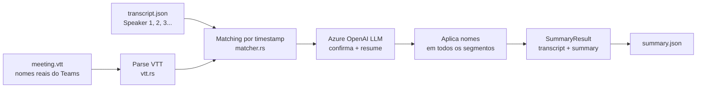
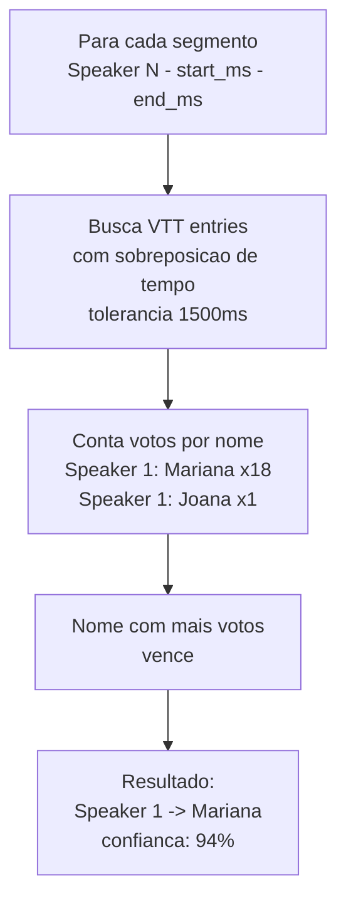

# Summarizer de Reunioes

> **Objetivo:** identificar os participantes reais de uma reuniao cruzando a
> transcricao do Azure AI Speech com o VTT do Teams, e gerar resumo executivo,
> pontos de acao e decisoes via LLM (Azure OpenAI).

---

## Visao Geral

O summarizer recebe dois arquivos de uma mesma reuniao e produz uma
transcricao completa com nomes reais, estruturada e resumida.



**Por que dois servicos separados?**

| Etapa | Servico | Motivo |
|---|---|---|
| Transcricao | Azure AI Speech | Nao usa deployment — modelo embutido no endpoint |
| Resumo e matching | Azure OpenAI | Requer deployment nomeado na URL |

---

## Como Usar

### Pre-requisito

O arquivo `transcript.json` deve ter sido gerado pelo `transcribe`:

```sh
cargo run --bin transcribe -- temp/audio.wav
# gera: temp/audio_transcript.json
```

### Exportar o VTT do Teams

1. Abra a gravacao no Teams
2. Clique em **...** no player de video
3. **Abrir transcricao** → **Baixar** → formato `.vtt`

### Comando

```sh
cargo run --bin summarize -- <transcript.json> <meeting.vtt>
```

### Exemplos

```sh
# Caminhos simples
cargo run --bin summarize -- temp/audio_transcript.json temp/meeting.vtt

# VTT com espacos no nome (use aspas)
cargo run --bin summarize -- temp/real_transcript.json "temp/_Rocas_ Reuniao de Alinhamento.vtt"
```

### Saida no terminal

```
Summarizer - Azure OpenAI + Teams VTT
  Transcript : temp/real-curto_transcript.json
  VTT        : temp/real-curto.vtt
  Deployment : gpt-5.4-mini
  API version: 2025-04-01-preview

Participantes no VTT (3):
  - Joana Lopes
  - Lucas Oliveira
  - Mariana Cardoso Fabre Albino

Chamando gpt-5.4-mini para confirmar mapeamento e gerar resumo...
Mapeamento de falantes (tempo: 3.8s)
  Speaker 1 -> Mariana Cardoso Fabre Albino
  Speaker 2 -> Joana Lopes
  Speaker 3 -> Lucas Oliveira

------------------------------------------------------------
RESUMO
------------------------------------------------------------
A reuniao tratou do refinamento dos requisitos da plataforma...

PONTOS DE ACAO
------------------------------------------------------------
  - Lucas Oliveira: finalizar o questionario ate o fim do dia
  - Joana Lopes: revisar o questionario e dar retorno

DECISOES
------------------------------------------------------------
  - A plataforma deve ser desenhada de forma escalavel

------------------------------------------------------------
TRANSCRICAO (99 segmentos)
------------------------------------------------------------
[00:00] Mariana Cardoso Fabre Albino: da coordenadora pedagogica...
[00:14] Joana Lopes: Microfone aberto, acho que eu estou aqui...
[00:33] Lucas Oliveira: Eu na plataforma eu vi que esta ate o terceiro...

JSON salvo em: temp/real-curto_summary.json
```

---

## Configuracao (`.env`)

| Variavel | Obrigatoria | Descricao |
|---|---|---|
| `AZURE_OPENAI_API_KEY` | sim | Chave do recurso Azure OpenAI |
| `AZURE_OPENAI_ENDPOINT` | sim | URL base do recurso |
| `AZURE_OPENAI_DEPLOYMENT` | sim | Nome do deployment do modelo LLM (ex.: `gpt-5.4-mini`) |
| `AZURE_OPENAI_API_VERSION` | nao | Versao da API (padrao: `2025-01-01-preview`) |

> **Por que `DEPLOYMENT` e obrigatorio aqui mas nao no `transcribe`?**
> O Azure OpenAI exige o nome do deployment na URL:
> `/openai/deployments/{deployment}/chat/completions`.
> O Azure AI Speech nao tem esse conceito — o modelo esta embutido no endpoint.

Exemplo de `.env`:
```env
AZURE_OPENAI_API_KEY=sua-chave-aqui
AZURE_OPENAI_ENDPOINT=https://seu-recurso.cognitiveservices.azure.com
AZURE_OPENAI_DEPLOYMENT=gpt-5.4-mini
# AZURE_OPENAI_API_VERSION=2025-01-01-preview
```

---

## Formato VTT do Teams

O arquivo `.vtt` exportado pelo Teams segue o padrao WebVTT com extensoes
de voz (`<v Name>`):

```
WEBVTT

c83a7d7c-ef1b-4a98-8cc0-8abe652ded43/11-0
00:00:03.833 --> 00:00:10.338
<v Mariana Cardoso Fabre Albino>A coordenadora pedagogica la da unidade.
E era a pergunta dele sobre se uma turma,</v>

c83a7d7c-ef1b-4a98-8cc0-8abe652ded43/10-0
00:00:04.153 --> 00:00:05.193
<v Joana Lopes>Next time.</v>
```

**Estrutura de cada bloco:**
- Linha 1: ID do cue (`UUID/N-M`) — ignorado pelo parser
- Linha 2: Timestamps `HH:MM:SS.mmm --> HH:MM:SS.mmm`
- Linha 3+: Texto com tag `<v Nome Completo>...</v>` (pode ter multiplas linhas)

Tags internas como `<lang pt-BR>` sao removidas automaticamente.

---

## Como o Matching Funciona



A sobreposicao e calculada com tolerancia de **1500 ms** para compensar
diferencas de sincronizacao entre o Azure Speech e o Teams VTT.

**Exemplo de matching:**

| Segmento (Azure Speech) | VTT sobrepostos | Votos |
|---|---|---|
| Speaker 1 — 00:00 a 00:12 | Mariana (x1) | Mariana: 1 |
| Speaker 1 — 00:22 a 00:27 | Mariana (x1) | Mariana: 2 |
| Speaker 1 — 00:27 a 00:30 | Mariana (x1) | Mariana: 3 |
| **Resultado** | | **Speaker 1 → Mariana** |

---

## Papel do LLM

Apos o matching por timestamp, o LLM recebe:

1. **Amostras por falante** (3 segmentos de cada Speaker N)
2. **Amostras do VTT** (3 entradas de cada participante)
3. **Mapeamento inicial** com contagem e confianca
4. **Texto completo** da transcricao (ate 3000 chars)

E produz em JSON:

```json
{
  "speaker_mapping": {
    "Speaker 1": "Mariana Cardoso Fabre Albino",
    "Speaker 2": "Joana Lopes",
    "Speaker 3": "Lucas Oliveira"
  },
  "summary": "Resumo executivo em 3-5 paragrafos...",
  "action_items": [
    "Lucas Oliveira: finalizar o questionario ate o fim do dia",
    "Joana Lopes: revisar o questionario e dar retorno"
  ],
  "key_decisions": [
    "A plataforma deve ser desenhada de forma escalavel",
    "Um professor por turma do 1 ao 3 ano"
  ]
}
```

O mapeamento do LLM e aplicado sobre **todos os segmentos** da transcricao
(nao apenas a amostra enviada).

---

## Saida JSON

Arquivo `<stem>_summary.json` salvo no mesmo diretorio do transcript:

```json
{
  "speaker_mapping": {
    "Speaker 1": "Mariana Cardoso Fabre Albino",
    "Speaker 2": "Joana Lopes",
    "Speaker 3": "Lucas Oliveira"
  },
  "summary": "A reuniao tratou do refinamento dos requisitos...",
  "action_items": [
    "Lucas Oliveira: finalizar o questionario ate o fim do dia"
  ],
  "key_decisions": [
    "A plataforma deve ser desenhada de forma escalavel"
  ],
  "segment_count": 99,
  "token_usage": {
    "prompt_tokens": 12480,
    "completion_tokens": 1024,
    "total_tokens": 13504
  },
  "transcript": [
    {
      "speaker": "Mariana Cardoso Fabre Albino",
      "time": "00:00",
      "start_ms": 40,
      "text": "da coordenadora pedagogica la da unidade...",
      "confidence": 0.697
    }
  ]
}
```

### Campos do JSON

| Campo | Tipo | Descricao |
|---|---|---|
| `speaker_mapping` | objeto | Mapa `Speaker N` -> nome real confirmado pelo LLM |
| `summary` | string | Resumo executivo em 3-5 paragrafos |
| `action_items` | array | Pontos de acao com responsavel nomeado |
| `key_decisions` | array | Decisoes tomadas na reuniao |
| `token_usage.prompt_tokens` | number | Tokens de entrada consumidos pelo LLM |
| `token_usage.completion_tokens` | number | Tokens de saída gerados pelo LLM |
| `token_usage.total_tokens` | number | Total de tokens da chamada |
| `segment_count` | number | Total de segmentos na transcricao |
| `transcript[].speaker` | string | Nome real do falante |
| `transcript[].time` | string | Timestamp formatado (`MM:SS`) |
| `transcript[].start_ms` | number | Inicio em millisegundos |
| `transcript[].text` | string | Texto do segmento |
| `transcript[].confidence` | number | Confianca da transcricao (0.0-1.0) |

---

## Endpoint Azure OpenAI

```
POST {endpoint}/openai/deployments/{deployment}/chat/completions
     ?api-version={api_version}
```

**Headers:**
```
api-key: <AZURE_OPENAI_API_KEY>
Content-Type: application/json
```

**Body:**
```json
{
  "messages": [
    { "role": "system", "content": "..." },
    { "role": "user",   "content": "..." }
  ],
  "temperature": 0.1,
  "max_completion_tokens": 4096,
  "response_format": { "type": "json_object" }
}
```

> `max_completion_tokens` e obrigatorio para modelos como `gpt-5.4-mini`.
> Modelos mais antigos usam `max_tokens` — o campo correto depende do modelo.

---

## Estrutura de Arquivos

```
src/
├── bin/
│   └── summarize.rs          <- binario CLI
└── summarizer/
    ├── mod.rs                <- summarize(), tipos, orquestracao
    ├── vtt.rs                <- parser do VTT do Teams
    ├── matcher.rs            <- matching por timestamp
    └── llm.rs                <- cliente Azure OpenAI chat completions
```

### Tipos principais

| Tipo | Descricao |
|---|---|
| `SummarizerConfig` | Credenciais Azure OpenAI carregadas do `.env` |
| `SummaryResult` | Resultado: `speaker_mapping`, `transcript`, `summary`, `action_items`, `key_decisions` |
| `NamedSegment` | Segmento com nome real: `speaker_name`, `time`, `start_ms`, `text`, `confidence` |
| `SummarizerError` | Erros: `Config`, `Io`, `Http`, `Parse` |
| `VttEntry` | Entrada do VTT: `name`, `start_ms`, `end_ms`, `text` |
| `SpeakerMatch` | Resultado do matching: `speaker_label`, `name`, `match_count`, `confidence` |

### Funcoes publicas

| Funcao | Descricao |
|---|---|
| `summarize(transcript, vtt, config)` | Ponto de entrada — parse, match, LLM, aplicacao |
| `SummarizerConfig::from_env()` | Carrega credenciais do `.env` |
| `SummaryResult::format_output()` | Formata transcricao com nomes para o terminal |
| `SummaryResult::to_json()` | Serializa resultado completo |
| `vtt::parse(content)` | Parseia conteudo VTT em `Vec<VttEntry>` |
| `matcher::match_speakers(segs, vtt, tol)` | Matching por sobreposicao de timestamps |
