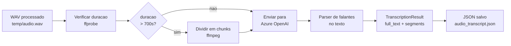
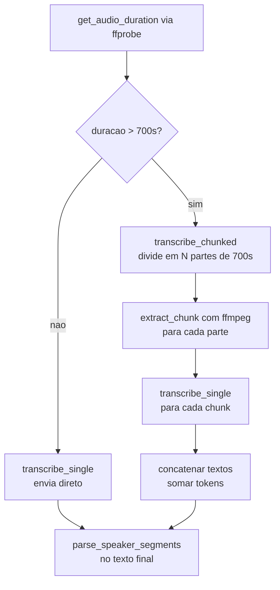

# Transcrição de Áudio via Azure OpenAI

> **Objetivo:** converter arquivos WAV processados em texto,
> com identificação automática de falantes (diarização) quando disponível.

---

## Visão Geral

O módulo de transcrição envia o áudio para o endpoint de transcrição do
Azure OpenAI e devolve o texto junto com estatísticas de uso. Arquivos
longos são divididos automaticamente em chunks para respeitar os limites
da API.



---

## Como Usar

### Comando

```sh
cargo run --bin transcribe -- <caminho_do_audio.wav>
```

### Exemplos

```sh
# Arquivo curto (direto para a API)
cargo run --bin transcribe -- temp/teste.wav

# Arquivo longo (dividido automaticamente em chunks de 700s)
cargo run --bin transcribe -- temp/real.wav
```

### Saida no terminal

```
Transcricao de audio via Azure OpenAI
  Arquivo    : temp/teste.wav
  Tamanho    : 0.8 MB
  Duracao    : 00:25
  Endpoint   : https://<recurso>.cognitiveservices.azure.com
  Deployment : gpt-4o-transcribe-diarize
  API version: 2025-04-01-preview

Enviando para Azure OpenAI...
Tempo de resposta  : 8.3s
Falantes detectados: nao (texto unico)

--- Tokens ---------------------------------------------------
  Total   : 952
  Input   : 257  (audio -> $0.000643)
  Output  : 695  (texto -> $0.006950)

--- Custo estimado (gpt-4o-transcribe-diarize) ---------------
  Por tokens    : $0.007592  (257 in x $2.50/M + 695 out x $10.00/M)
  Por minuto    : $0.002576  (0.43 min x $0.006/min)
  Media         : $0.005084

------------------------------------------------------------

Vamos testar aqui para ver se vai ficar legal o audio...

------------------------------------------------------------

JSON salvo em: temp/teste_transcript.json
```

---

## Configuracao (`.env`)

O binário lê as credenciais do arquivo `.env` na raiz do projeto:

| Variavel | Obrigatoria | Descricao |
|---|---|---|
| `AZURE_OPENAI_API_KEY` | sim | Chave de acesso ao recurso Azure |
| `AZURE_OPENAI_ENDPOINT` | sim | URL base (ex.: `https://<recurso>.cognitiveservices.azure.com`) |
| `AZURE_OPENAI_DEPLOYMENT` | sim | Nome do deployment (ex.: `gpt-4o-transcribe-diarize`) |
| `AZURE_OPENAI_API_VERSION` | nao | Versao da API REST (padrao: `2025-04-01-preview`) |
| `AZURE_OPENAI_LANGUAGE` | nao | Idioma forcado, ex.: `pt`. Omitir = deteccao automatica |

Exemplo de `.env`:
```env
AZURE_OPENAI_API_KEY=sua-chave-aqui
AZURE_OPENAI_ENDPOINT=https://meu-recurso.cognitiveservices.azure.com
AZURE_OPENAI_DEPLOYMENT=gpt-4o-transcribe-diarize
AZURE_OPENAI_API_VERSION=2025-04-01-preview
```

---

## Limite de Arquivo e Chunking Automatico

A API do Azure OpenAI aceita no maximo **25 MB por requisicao**.

Para WAV 16-bit mono 16 kHz, o tamanho cresce a **32 KB/s**:

| Duracao | Tamanho aproximado |
|---|---|
| 10 min | 19 MB |
| 12 min | 22 MB (chunk padrao) |
| 20 min | 37 MB — divide em 2 chunks |
| 38 min | 70 MB — divide em 4 chunks |

O modulo verifica a duracao com `ffprobe` antes de enviar. Se ultrapassar
**700 segundos (~12 min, ~22 MB)**, o arquivo e dividido com `ffmpeg` em
partes sequenciais. Os textos de cada parte sao concatenados na ordem
correta ao final.



Os chunks temporarios sao criados em `/tmp/rust_stt_chunks/` e removidos
apos cada transcricao.

---

## Diarizacao de Falantes

O modelo `gpt-4o-transcribe-diarize` pode retornar marcadores de falante
**embutidos no texto** dependendo do conteudo do audio:

```
Speaker 1: Bom dia a todos.
Speaker 2: Ola, vamos comecar a reuniao.
Speaker 1: Sim, vamos la.
```

O parser detecta esses marcadores automaticamente. Padroes reconhecidos
(sem diferenciacao de maiusculas/minusculas):

| Padrao | Exemplo |
|---|---|
| `Speaker N:` | `Speaker 1: texto` |
| `[Speaker N]:` | `[Speaker 2]: texto` |
| `Falante N:` | `Falante 1: texto` |
| `Locutor N:` | `Locutor 2: texto` |

Quando falantes sao detectados, o `format_output()` exibe por segmento:

```
Speaker 1:
  Bom dia a todos.

Speaker 2:
  Ola, vamos comecar a reuniao.
```

Quando o audio tem apenas um falante (ou o modelo nao emite marcadores),
o texto completo e exibido sem divisoes.

---

## Saida JSON

Alem da saida no terminal, um arquivo `<stem>_transcript.json` e salvo
no mesmo diretorio do audio de entrada.

Schema do arquivo gerado:

```json
{
  "full_text": "Texto completo da transcricao...",
  "speakers_detected": false,
  "segment_count": 1,
  "segments": [
    {
      "speaker": null,
      "text": "Texto completo da transcricao..."
    }
  ],
  "usage": {
    "total_tokens": 945,
    "input_tokens": 257,
    "output_tokens": 688
  }
}
```

Exemplo com diarizacao:

```json
{
  "full_text": "Speaker 1: Bom dia. Speaker 2: Ola.",
  "speakers_detected": true,
  "segment_count": 2,
  "segments": [
    { "speaker": "Speaker 1", "text": "Bom dia." },
    { "speaker": "Speaker 2", "text": "Ola." }
  ],
  "usage": {
    "total_tokens": 1200,
    "input_tokens": 500,
    "output_tokens": 700
  }
}
```

---

## Estimativa de Custo

Precos do modelo `gpt-4o-transcribe-diarize` (valores em USD):

| Metrica | Preco |
|---|---|
| Input tokens (audio) | $2.50 / 1 M tokens |
| Output tokens (texto) | $10.00 / 1 M tokens |
| Estimativa por minuto | $0.006 / min de audio |

O binario exibe **dois metodos de calculo** apos cada transcricao:

### Por tokens (usando consumo real da API)

```
custo = (input_tokens / 1_000_000 * 2.50)
      + (output_tokens / 1_000_000 * 10.00)
```

Mais preciso pois usa o numero exato de tokens consumidos.

### Por minuto (estimativa oficial)

```
custo = duracao_minutos * 0.006
```

Util para estimar o custo **antes** de rodar, conhecendo apenas a duracao do audio.

### Media

A media entre os dois metodos serve como referencia conservadora.

### Exemplos reais

| Audio | Duracao | Input tokens | Output tokens | Por tokens | Por minuto | Media |
|---|---|---|---|---|---|---|
| teste.wav | 0:25 | 257 | 695 | $0.007592 | $0.002576 | $0.005084 |
| 10 min | 10:00 | ~6 000 | ~16 000 | ~$0.175 | $0.060 | ~$0.118 |
| 38 min | 38:00 | ~22 000 | ~60 000 | ~$0.655 | $0.228 | ~$0.442 |

> Os tokens de input para audio sao proporcio nais a duracao (~257 tokens/25s ~ 600 tokens/min).
> Os tokens de output variam conforme a densidade da fala no audio.

---

## Limitacoes Conhecidas da API

| Limitacao | Detalhe |
|---|---|
| `verbose_json` nao suportado | `gpt-4o-transcribe-diarize` aceita apenas `json` e `text` |
| Sem timestamps por segmento | A API nao retorna `start`/`end` por falante nesta versao |
| `prompt` nao suportado | O parametro de prompt e rejeitado com erro 400 |
| Diarizacao estruturada ausente | Segmentos com speaker so aparecem se o modelo emitir marcadores no texto |
| `chunking_strategy` obrigatorio | Deve ser passado como `auto` para modelos de diarizacao |
| Limite de 25 MB por requisicao | Tratado automaticamente pelo chunking interno |

---

## Estrutura de Arquivos

```
src/
├── bin/
│   └── transcribe.rs          <- binario CLI
└── transcriber/
    ├── mod.rs                 <- transcribe(), chunking, parser, tipos
    └── azure.rs               <- cliente HTTP Azure OpenAI
```

### Tipos principais (`src/transcriber/mod.rs`)

| Tipo | Descricao |
|---|---|
| `TranscriptionConfig` | Credenciais e opcoes carregadas do `.env` |
| `TranscriptionResult` | Resultado: `full_text`, `segments`, `usage` |
| `Segment` | Turno de fala: `speaker` (opcional) + `text` |
| `UsageInfo` | Tokens consumidos: `total`, `input`, `output` |
| `TranscriberError` | Erros: `Config`, `Io`, `Http`, `Parse` |

### Funcoes publicas

| Funcao | Descricao |
|---|---|
| `transcribe(path, config)` | Ponto de entrada — chunking automatico se necessario |
| `TranscriptionConfig::from_env()` | Carrega credenciais das variaveis de ambiente |
| `TranscriptionResult::format_output()` | Formata para exibicao no terminal |
| `TranscriptionResult::to_json()` | Serializa para salvar em arquivo |

---

## Endpoint Azure OpenAI

```
POST {endpoint}/openai/deployments/{deployment}/audio/transcriptions
     ?api-version={api_version}
```

**Headers:**
```
api-key: <AZURE_OPENAI_API_KEY>
Content-Type: multipart/form-data
```

**Body (multipart/form-data):**

| Campo | Valor |
|---|---|
| `file` | Arquivo WAV (bytes + nome) |
| `response_format` | `json` |
| `chunking_strategy` | `auto` (obrigatorio para modelos de diarizacao) |
| `language` | ex.: `pt` (opcional) |

**Resposta:**
```json
{
  "text": "Transcricao completa...",
  "usage": {
    "type": "tokens",
    "total_tokens": 945,
    "input_tokens": 257,
    "input_token_details": { "text_tokens": 0, "audio_tokens": 257 },
    "output_tokens": 688
  }
}
```
