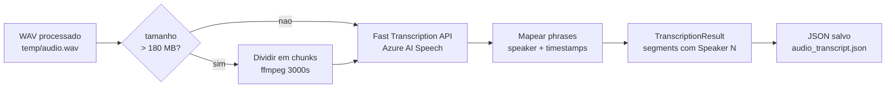
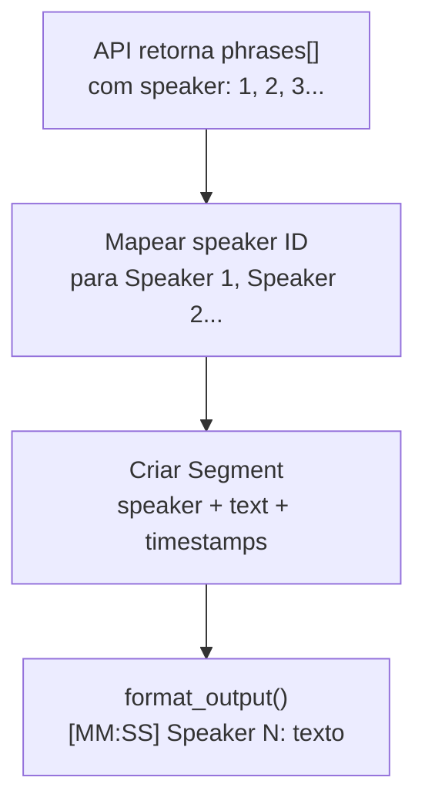

# Transcricao de Audio via Azure AI Speech

> **Objetivo:** converter arquivos WAV processados em texto com
> **diarizacao real por falante**, timestamps por segmento e estimativa de custo.

---

## Visao Geral

O modulo usa a **Fast Transcription API** do Azure AI Speech (`api-version=2024-11-15`),
que retorna falantes identificados estruturalmente (`speaker: 1`, `speaker: 2`...),
timestamps de inicio/fim por segmento e confianca da transcricao.



A API aceita arquivos de ate **~200 MB / 4 horas** diretamente —
sem necessidade de chunking para a maioria dos casos.

---

## Como Usar

### Comando

```sh
cargo run --bin transcribe -- <caminho_do_audio.wav>
```

### Exemplos

```sh
# Arquivo curto
cargo run --bin transcribe -- temp/teste.wav

# Reuniao com multiplos falantes
cargo run --bin transcribe -- temp/real-curto.wav
```

### Saida no terminal

```
Transcricao de audio - Azure AI Speech
  Arquivo    : temp/real-curto.wav
  Tamanho    : 19.4 MB
  Duracao    : 10:36
  Endpoint   : https://<recurso>.cognitiveservices.azure.com
  Idioma     : pt-BR
  Max speakers: 10

Enviando para Azure AI Speech...
Tempo de resposta : 33.5s
Duracao (API)     : 10:36
Segmentos         : 99
Falantes          : 3 detectado(s)
  Speaker 1 - 19 segmento(s)
  Speaker 2 - 39 segmento(s)
  Speaker 3 - 41 segmento(s)

--- Custo estimado (Azure AI Speech) ----------------------
  10.62 min x $1.00/hora = $0.176935
  (preco padrao: $1.00/hora de audio transcrito)

------------------------------------------------------------

[00:00] Speaker 1: da coordenadora pedagogica la da unidade...
[00:14] Speaker 2: Microfone aberto, acho que eu estou aqui no tipo open space.
[00:22] Speaker 1: E nao, do primeiro ao terceiro, os professores e um para cada turma.
[00:33] Speaker 3: Eu na plataforma eu vi que esta ate o terceiro...

------------------------------------------------------------

JSON salvo em: temp/real-curto_transcript.json
```

---

## Configuracao (`.env`)

| Variavel | Obrigatoria | Descricao |
|---|---|---|
| `AZURE_SPEECH_KEY` | nao* | Chave do recurso Azure AI Speech |
| `AZURE_SPEECH_ENDPOINT` | nao* | URL base do recurso Speech |
| `AZURE_OPENAI_API_KEY` | fallback | Usado se `AZURE_SPEECH_KEY` nao estiver definido |
| `AZURE_OPENAI_ENDPOINT` | fallback | Usado se `AZURE_SPEECH_ENDPOINT` nao estiver definido |
| `AZURE_SPEECH_LANGUAGE` | nao | Idioma da transcricao (padrao: `pt-BR`) |
| `AZURE_SPEECH_MAX_SPEAKERS` | nao | Maximo de falantes para diarizacao (padrao: `10`) |

> *Se o recurso Azure for multi-servico (OpenAI + Speech na mesma chave/endpoint),
> as variaveis `AZURE_OPENAI_*` funcionam como fallback automatico.

Exemplo de `.env`:
```env
# Recurso dedicado ao Speech (opcional — usa AZURE_OPENAI_* como fallback)
# AZURE_SPEECH_KEY=sua-chave-speech
# AZURE_SPEECH_ENDPOINT=https://seu-recurso-speech.cognitiveservices.azure.com

# Recurso multi-servico (OpenAI + Speech)
AZURE_OPENAI_API_KEY=sua-chave-aqui
AZURE_OPENAI_ENDPOINT=https://seu-recurso.cognitiveservices.azure.com

# Opcoes de transcricao
# AZURE_SPEECH_LANGUAGE=pt-BR
# AZURE_SPEECH_MAX_SPEAKERS=10
```

---

## Diarizacao de Falantes

A API retorna um ID numerico por falante (`speaker: 1`, `speaker: 2`...) em cada
segmento de fala. O modulo mapeia esses IDs para rotulos `Speaker 1`, `Speaker 2` etc.

### Como funciona



### Saida com multiplos falantes

```
[00:00] Speaker 1: Bom dia a todos.
[00:03] Speaker 2: Ola, vamos comecar a reuniao.
[00:07] Speaker 1: Sim, vamos la.
[00:09] Speaker 3: Posso compartilhar a tela?
```

Os IDs sao consistentes dentro de um arquivo — `Speaker 1` na linha 1 e `Speaker 1`
na linha 50 sao a mesma pessoa.

---

## Limite de Arquivo e Chunking

A Fast Transcription API aceita arquivos de ate **~200 MB**. O modulo usa
**180 MB** como limite conservador antes de acionar o chunking.

Para WAV 16-bit mono 16 kHz (**32 KB/s**):

| Duracao | Tamanho | Comportamento |
|---|---|---|
| ate 93 min | ate 178 MB | Envio direto, sem chunking |
| 93 min - 186 min | 178 MB - 356 MB | 2 chunks de ~50 min cada |
| Reuniao tipica (10-60 min) | 19 MB - 115 MB | Envio direto |

Quando o chunking e acionado, os timestamps de cada parte sao ajustados
para a posicao global no audio antes de concatenar os segmentos.

---

## Saida JSON

Alem da saida no terminal, um arquivo `<stem>_transcript.json` e salvo
no mesmo diretorio do audio.

```json
{
  "full_text": "Bom dia a todos. Ola, vamos comecar...",
  "duration_ms": 636000,
  "speakers_detected": true,
  "speaker_count": 3,
  "speakers": ["Speaker 1", "Speaker 2", "Speaker 3"],
  "segment_count": 99,
  "segments": [
    {
      "speaker": "Speaker 1",
      "text": "da coordenadora pedagogica la da unidade...",
      "start_ms": 0,
      "end_ms": 11760,
      "start_time": "00:00",
      "confidence": 0.92
    },
    {
      "speaker": "Speaker 2",
      "text": "Microfone aberto, acho que eu estou aqui no tipo open space.",
      "start_ms": 14560,
      "end_ms": 21880,
      "start_time": "00:14",
      "confidence": 0.97
    }
  ]
}
```

### Campos do JSON

| Campo | Tipo | Descricao |
|---|---|---|
| `full_text` | string | Texto completo concatenado (de `combinedPhrases`) |
| `duration_ms` | number | Duracao total em millisegundos |
| `speakers_detected` | bool | `true` se ao menos um falante foi identificado |
| `speaker_count` | number | Quantidade de falantes distintos |
| `speakers` | array | Lista de rotulos (`Speaker 1`, `Speaker 2`...) |
| `segment_count` | number | Total de segmentos de fala |
| `segments[].speaker` | string | Rotulo do falante deste segmento |
| `segments[].text` | string | Texto transcrito |
| `segments[].start_ms` | number | Inicio em millisegundos |
| `segments[].end_ms` | number | Fim em millisegundos |
| `segments[].start_time` | string | Inicio formatado (`MM:SS`) |
| `segments[].confidence` | number | Confianca da transcricao (0.0-1.0) |

---

## Estimativa de Custo

Azure AI Speech Fast Transcription — preco por hora de audio:

| Metrica | Preco |
|---|---|
| Transcricao padrao com diarizacao | $1.00 / hora de audio |

```
custo = (duracao_minutos / 60) * 1.00
```

### Exemplos reais

| Audio | Duracao | Custo estimado |
|---|---|---|
| teste.wav | 0:25 | $0.007 |
| real-curto.wav | 10:36 | $0.177 |
| reuniao de 1h | 60:00 | $1.000 |
| reuniao de 38min | 38:00 | $0.633 |

---

## Endpoint Azure AI Speech

```
POST {endpoint}/speechtotext/transcriptions:transcribe?api-version=2024-11-15
```

**Headers:**
```
Ocp-Apim-Subscription-Key: <AZURE_SPEECH_KEY>
Content-Type: multipart/form-data
```

**Body (multipart/form-data):**

| Campo | Content-Type | Valor |
|---|---|---|
| `audio` | `audio/wav` | Arquivo WAV em bytes |
| `definition` | `application/json` | JSON de configuracao (ver abaixo) |

**Definition JSON:**
```json
{
  "locales": ["pt-BR"],
  "diarization": {
    "enabled": true,
    "maxSpeakers": 10
  },
  "channels": [0],
  "profanityFilterMode": "None"
}
```

**Resposta (200 OK):**
```json
{
  "durationMilliseconds": 636000,
  "combinedPhrases": [
    { "channel": 0, "text": "Texto completo concatenado..." }
  ],
  "phrases": [
    {
      "channel": 0,
      "speaker": 1,
      "offsetMilliseconds": 0,
      "durationMilliseconds": 11760,
      "text": "da coordenadora pedagogica...",
      "confidence": 0.92,
      "locale": "pt-BR",
      "words": [
        { "text": "da", "offsetMilliseconds": 0, "durationMilliseconds": 120 }
      ]
    }
  ]
}
```

---

## Estrutura de Arquivos

```
src/
├── bin/
│   └── transcribe.rs              <- binario CLI
└── transcriber/
    ├── mod.rs                     <- transcribe(), tipos, formatacao
    └── azure_speech.rs            <- cliente HTTP Azure AI Speech
```

### Tipos principais (`src/transcriber/mod.rs`)

| Tipo | Descricao |
|---|---|
| `TranscriptionConfig` | Credenciais e opcoes carregadas do `.env` |
| `TranscriptionResult` | Resultado: `full_text`, `segments`, `duration_ms` |
| `Segment` | Segmento de fala: `speaker`, `text`, timestamps, `confidence` |
| `TranscriberError` | Erros: `Config`, `Io`, `Http`, `Parse` |

### Funcoes publicas

| Funcao | Descricao |
|---|---|
| `transcribe(path, config)` | Ponto de entrada — chunking automatico se > 180 MB |
| `TranscriptionConfig::from_env()` | Carrega credenciais com fallback para vars OpenAI |
| `TranscriptionResult::format_output()` | Formata com timestamps e Speaker N |
| `TranscriptionResult::to_json()` | Serializa para arquivo com todos os campos |
| `ms_to_time(ms)` | Converte millisegundos para `MM:SS` |

---

## Comparativo com a Versao Anterior

A versao anterior usava Azure OpenAI (`gpt-4o-transcribe-diarize`).
A migracao para Azure AI Speech trouxe:

| | Azure OpenAI (anterior) | Azure AI Speech (atual) |
|---|---|---|
| Diarizacao | Nao funcionava - texto plano sem speaker | Speaker 1/2/3 por segmento |
| Timestamps | Nao existia | Inicio/fim em ms por segmento |
| Confianca | Nao existia | 0.0-1.0 por segmento |
| Limite por requisicao | 25 MB (chunking em 700s) | 200 MB (chunking raramente necessario) |
| Custo | Por tokens (input + output) | Por hora de audio ($1.00/h) |
| Header de autenticacao | `api-key` | `Ocp-Apim-Subscription-Key` |
| Endpoint | `/openai/deployments/.../audio/transcriptions` | `/speechtotext/transcriptions:transcribe` |
