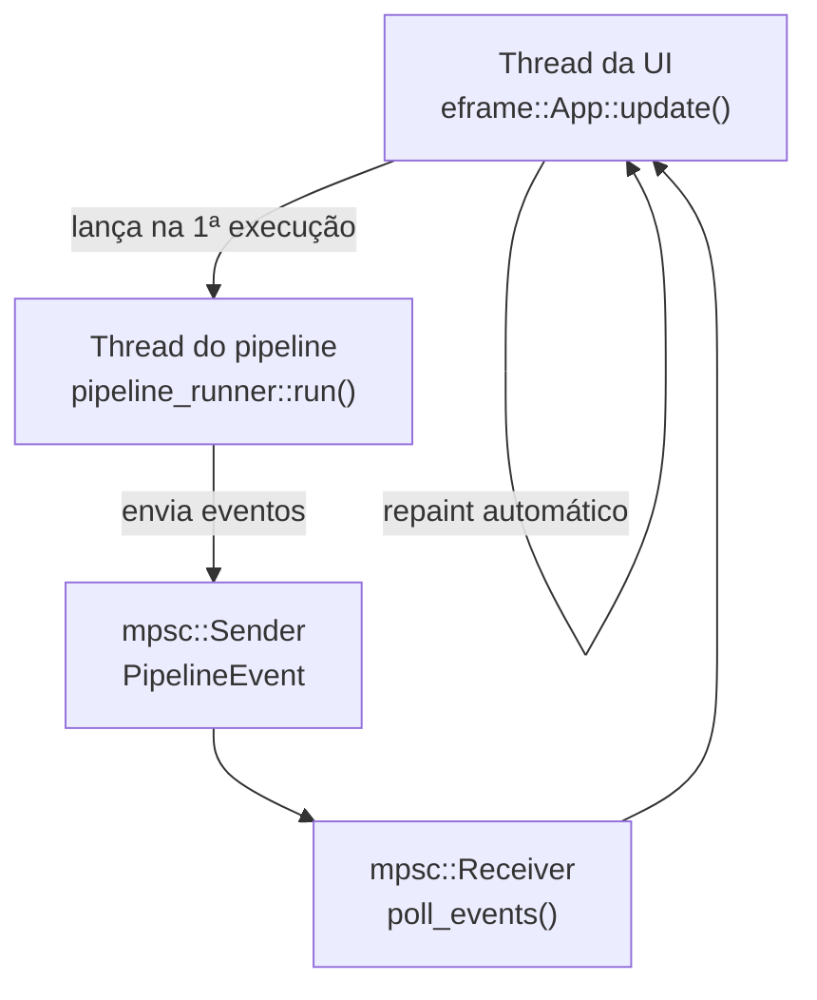
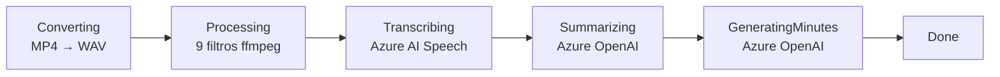

# Interface Gráfica Nativa — app

> **Objetivo:** orquestrar o pipeline completo MP4+VTT → ata em uma janela
> nativa cross-platform (Linux, macOS, Windows), com progresso em tempo real,
> persistência de configurações e histórico de custos.

---

## Visão Geral

O binário `app` usa [egui](https://github.com/emilk/egui) /
[eframe](https://github.com/emilk/egui/tree/master/crates/eframe) para
renderizar a janela e [rfd](https://github.com/PolyMeilex/rfd) para diálogos
nativos de arquivo.



O pipeline roda em **thread dedicada** e se comunica com a UI exclusivamente
via `mpsc::channel<PipelineEvent>`. A thread da UI drena o canal a cada frame
e solicita `ctx.request_repaint()` enquanto o pipeline está ativo.

---

## Como Executar

```sh
cargo run --bin app
# ou, após build release:
./target/release/app
```

---

## Layout da Janela

```
┌────────────────────────────────────────────────────────┐
│  rust-stt                        [⚙ Config] [💰 Custos] │
├────────────────────────────────────────────────────────┤
│                                                        │
│  Arquivos                                              │
│  📹 Vídeo MP4   [Selecionar…]   ✓ reuniao.mp4         │
│  📄 Legenda VTT [Selecionar…]   ✓ reuniao.vtt         │
│                                                        │
│  [▶ Iniciar pipeline]                                  │
│                                                        │
│  Progresso                                             │
│  ✓ Conversão MP4 → WAV                                │
│  ✓ Processamento de áudio (9 filtros)                 │
│  ⏳ Transcrição (Azure AI Speech)...                   │
│  ○ Resumo (Azure OpenAI)                              │
│  ○ Ata de reunião (FLOW)                              │
│  [████████░░░░░░░] 40%                                │
│                                                        │
│  Resultado                                             │
│  [💾 Salvar Transcrição] [💾 Salvar Resumo] [💾 Salvar Ata] │
└────────────────────────────────────────────────────────┘
```

---

## Painéis

### Arquivos (`panel_files.rs`)

Dois seletores de arquivo usando diálogos nativos (`rfd::FileDialog`):

- **MP4** — filtro `.mp4`
- **VTT** — filtro `.vtt` (exportado do Teams)

Exibe nome do arquivo selecionado com `✓` verde ou `não selecionado` em cinza.

---

### Progresso (`panel_progress.rs`)

Exibe as 5 fases com ícones de estado:

| Ícone | Significado |
|---|---|
| `✓` verde | Fase concluída |
| `⏳` amarelo | Em andamento |
| `○` cinza | Pendente |
| `✗` vermelho | Erro |

Inclui barra de progresso (20% por fase) e log rolável com as últimas mensagens
do pipeline. O log é atualizado em tempo real via `PipelineEvent::LogLine`.

---

### Resultado (`panel_result.rs`)

Visível apenas quando o pipeline conclui. Três botões que abrem diálogos
nativos de "Salvar como":

- **Salvar Transcrição** → `transcript.json`
- **Salvar Resumo** → `summary.json`
- **Salvar Ata** → `minutes.json`

Os arquivos são mantidos em memória até o usuário escolher onde salvar.

---

### Configuração (`panel_config.rs`) — modal ⚙

Acessado pelo botão **⚙ Config** na barra superior. Formulário com todos os
campos de `AppConfig`:

| Seção | Campos |
|---|---|
| Azure OpenAI | Endpoint, API Key (mascarada), Deployment, API Version |
| Azure AI Speech | Endpoint, API Key (mascarada), Idioma, Máx. falantes |
| Preços | Entrada ($/1M tokens), Saída ($/1M tokens), Speech ($/hora) |

O botão **💾 Salvar** persiste em `~/.config/rust-stt/config.json`.
O formulário é carregado automaticamente na inicialização do app.

---

### Custos (`panel_costs.rs`) — modal 💰

Acessado pelo botão **💰 Custos** na barra superior. Duas seções:

**Sessão atual** — atualizada em tempo real após cada etapa:

```
Azure AI Speech
  38.6 min × $1.00/h = $0.6433

Azure OpenAI — Summarizer
  Entrada:    12.480 tokens  ($0.009360)
  Saída:       1.024 tokens  ($0.004608)

Azure OpenAI — Minutes
  Entrada:    18.920 tokens  ($0.014190)
  Saída:       3.200 tokens  ($0.014400)

────────────────────────────────────
Total tokens  :  35.624
Total estimado:  $0.6860
```

**Histórico** — tabela com todas as sessões anteriores:

| Data | Reunião | Áudio | Tokens | Custo |
|---|---|---|---|---|
| 16/04 14:32 | Alinhamento… | 38 min | 35.624 | $0.6860 |
| 15/04 09:10 | Sprint Review | 28 min | 22.100 | $0.5801 |
| MÉDIA | | 33 min | 28.862 | $0.6330 |
| TOTAL (2) | | 66 min | 57.724 | $1.2661 |

O histórico é persistido em `~/.config/rust-stt/cost_history.json` e pode
ser apagado com o botão **🗑 Limpar histórico**.

---

## Eventos do Pipeline

A thread do pipeline envia `PipelineEvent` via `mpsc::Sender`:

| Evento | Dados | Quando |
|---|---|---|
| `PhaseChanged` | `PipelinePhase` | Início de cada etapa |
| `LogLine` | `String` | Mensagens de progresso |
| `AudioDuration` | `f64` (minutos) | Após ffprobe no WAV |
| `StepCostReady` | `StepCost` | Após cada chamada LLM |
| `Done` | `PipelineResult` | Pipeline completo |
| `Error` | `String` | Qualquer falha |

---

## Fases do Pipeline



O WAV intermediário (da conversão) vai para `temp_dir/intermediate/` para
evitar colisão de nome com o WAV processado em `temp_dir/`.

---

## Persistência

| Arquivo | Conteúdo |
|---|---|
| `~/.config/rust-stt/config.json` | Credenciais e preços (`AppConfig`) |
| `~/.config/rust-stt/cost_history.json` | Histórico de sessões (`CostHistory`) |

Em sistemas sem `XDG_CONFIG_HOME` configurado, `dirs::config_dir()` usa
`~/.config` no Linux, `~/Library/Application Support` no macOS e
`%APPDATA%` no Windows.

---

## Limpeza de Arquivos Temporários

O app cria `$TMPDIR/rust_stt_ui/` na inicialização e o remove ao fechar
(via `eframe::App::on_exit`). Se o app for encerrado de forma abrupta, o
diretório será limpo na próxima abertura.

---

## Estrutura de Arquivos

```
src/
├── bin/
│   └── app.rs                  ← main(), eframe::run_native
└── ui/
    ├── mod.rs                  ← App, eframe::App::update, modais
    ├── app_state.rs            ← AppState, PipelinePhase, PipelineEvent,
    │                              AppConfig, SessionCost, CostHistory...
    ├── pipeline_runner.rs      ← thread do pipeline, conversões de config
    ├── panel_config.rs         ← formulário de credenciais, load/save
    ├── panel_files.rs          ← seletores de arquivo rfd
    ├── panel_progress.rs       ← poll_events(), fases, barra, log
    ├── panel_result.rs         ← botões salvar artefatos
    └── panel_costs.rs          ← sessão atual, histórico, persistência
```

### Tipos principais (`app_state.rs`)

| Tipo | Descrição |
|---|---|
| `AppState` | Estado global: paths, config, fase, log, custos, resultado |
| `PipelinePhase` | `Idle`, `Converting`, `Processing`, `Transcribing`, `Summarizing`, `GeneratingMinutes`, `Done`, `Error` |
| `PipelineEvent` | Eventos do pipeline para a UI |
| `AppConfig` | Credenciais + preços, serializado em JSON |
| `SessionCost` | Custo acumulado da sessão atual |
| `StepCost` | Custo de uma etapa LLM individual |
| `PipelineResult` | JSON strings dos 3 artefatos em memória |
| `CostHistory` / `HistoryEntry` | Histórico persistido de sessões |

---

## Dependências

| Crate | Versão | Uso |
|---|---|---|
| `eframe` | 0.29 | Janela nativa + loop de eventos |
| `egui` | 0.29 | Widgets immediate-mode |
| `rfd` | 0.15 | Diálogos nativos de arquivo |
| `dirs` | 5 | Caminhos de config por plataforma (XDG / AppData) |
